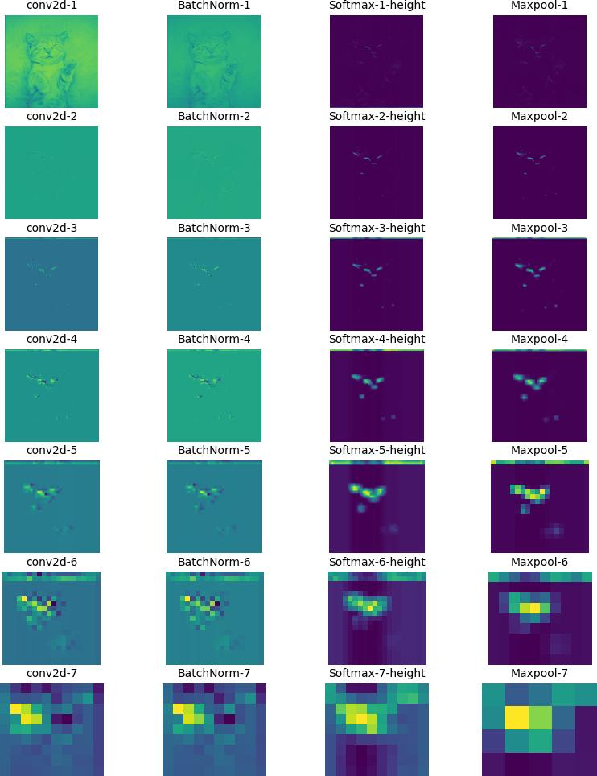

# Softmax for intermediate layers

Link to the notebook: [CNN](https://www.kaggle.com/code/sharathshebbar/cnn-don-t-use-softmax-for-intermediate-layer)

Context: Usually Softmax activation function will not be used in intermediate layer as it might lead to vanishing gradients problem as it squashes the input between 0 to 1.

Visualizing the CNN output while softmax is used in intermediate layers

Usually Softmax will be used for spatial dimension in the sense the height and width of an image

Softmax for height dimension

Softmax for width dimension

Softmax for both height and width dimension

The output of Intel Image Classification for softmax intermediate layers

Epoch [1 / 50], Training Loss: 1.884, Training Accuracy: 16.895
Epoch [2 / 50], Training Loss: 1.801, Training Accuracy: 17.510
Epoch [3 / 50], Training Loss: 1.815, Training Accuracy: 16.815
Epoch [4 / 50], Training Loss: 1.819, Training Accuracy: 16.441
Epoch [5 / 50], Training Loss: 1.820, Training Accuracy: 16.984
Epoch [6 / 50], Training Loss: 1.823, Training Accuracy: 16.762
Epoch [7 / 50], Training Loss: 1.812, Training Accuracy: 17.082
Epoch [8 / 50], Training Loss: 1.826, Training Accuracy: 16.708
Epoch [9 / 50], Training Loss: 1.821, Training Accuracy: 17.091
Epoch [10 / 50], Training Loss: 1.800, Training Accuracy: 16.842
Epoch [11 / 50], Training Loss: 1.814, Training Accuracy: 16.842
Epoch [12 / 50], Training Loss: 1.811, Training Accuracy: 17.127
Epoch [13 / 50], Training Loss: 1.826, Training Accuracy: 16.388
Epoch [14 / 50], Training Loss: 1.845, Training Accuracy: 16.637
Epoch [15 / 50], Training Loss: 1.814, Training Accuracy: 16.227
Epoch [16 / 50], Training Loss: 1.822, Training Accuracy: 16.655
Epoch [17 / 50], Training Loss: 1.817, Training Accuracy: 16.486
Epoch [18 / 50], Training Loss: 1.817, Training Accuracy: 17.073
Epoch [19 / 50], Training Loss: 1.812, Training Accuracy: 16.477
Epoch [20 / 50], Training Loss: 1.816, Training Accuracy: 17.127
Epoch [21 / 50], Training Loss: 1.819, Training Accuracy: 16.682
Epoch [22 / 50], Training Loss: 1.813, Training Accuracy: 16.877
Epoch [23 / 50], Training Loss: 1.823, Training Accuracy: 16.833
Epoch [24 / 50], Training Loss: 1.804, Training Accuracy: 19.015
Epoch [25 / 50], Training Loss: 1.739, Training Accuracy: 24.947
Epoch [26 / 50], Training Loss: 1.650, Training Accuracy: 33.488
Epoch [27 / 50], Training Loss: 1.530, Training Accuracy: 39.464
Epoch [28 / 50], Training Loss: 1.440, Training Accuracy: 41.788
Epoch [29 / 50], Training Loss: 1.389, Training Accuracy: 43.445
Epoch [30 / 50], Training Loss: 1.345, Training Accuracy: 44.549
Epoch [31 / 50], Training Loss: 1.293, Training Accuracy: 47.756
Epoch [32 / 50], Training Loss: 1.266, Training Accuracy: 48.219
Epoch [33 / 50], Training Loss: 1.251, Training Accuracy: 48.281
Epoch [34 / 50], Training Loss: 1.204, Training Accuracy: 50.588
Epoch [35 / 50], Training Loss: 1.176, Training Accuracy: 52.066
Epoch [36 / 50], Training Loss: 1.167, Training Accuracy: 52.387
Epoch [37 / 50], Training Loss: 1.155, Training Accuracy: 52.503
Epoch [38 / 50], Training Loss: 1.133, Training Accuracy: 53.919
Epoch [39 / 50], Training Loss: 1.114, Training Accuracy: 54.783
Epoch [40 / 50], Training Loss: 1.098, Training Accuracy: 54.925
Epoch [41 / 50], Training Loss: 1.093, Training Accuracy: 55.273
Epoch [42 / 50], Training Loss: 1.092, Training Accuracy: 54.542
Epoch [43 / 50], Training Loss: 1.073, Training Accuracy: 56.448
Epoch [44 / 50], Training Loss: 1.074, Training Accuracy: 55.504
Epoch [45 / 50], Training Loss: 1.065, Training Accuracy: 55.994
Epoch [46 / 50], Training Loss: 1.068, Training Accuracy: 55.851
Epoch [47 / 50], Training Loss: 1.056, Training Accuracy: 56.573
Epoch [48 / 50], Training Loss: 1.029, Training Accuracy: 59.236
Epoch [49 / 50], Training Loss: 1.003, Training Accuracy: 59.966
Epoch [50 / 50], Training Loss: 1.019, Training Accuracy: 58.452

The output of Intel Image Classification for ReLU intermediate layers

Epoch [1 / 50], Training Loss: 1.571, Training Accuracy: 44.968
Epoch [2 / 50], Training Loss: 1.038, Training Accuracy: 59.503
Epoch [3 / 50], Training Loss: 0.952, Training Accuracy: 63.529
Epoch [4 / 50], Training Loss: 0.848, Training Accuracy: 68.899
Epoch [5 / 50], Training Loss: 0.788, Training Accuracy: 70.315
Epoch [6 / 50], Training Loss: 0.778, Training Accuracy: 71.170
Epoch [7 / 50], Training Loss: 0.723, Training Accuracy: 73.156
Epoch [8 / 50], Training Loss: 0.722, Training Accuracy: 73.254
Epoch [9 / 50], Training Loss: 0.668, Training Accuracy: 74.840
Epoch [10 / 50], Training Loss: 0.658, Training Accuracy: 75.472
Epoch [11 / 50], Training Loss: 0.653, Training Accuracy: 76.006
Epoch [12 / 50], Training Loss: 0.617, Training Accuracy: 77.048
Epoch [13 / 50], Training Loss: 0.631, Training Accuracy: 76.354
Epoch [14 / 50], Training Loss: 0.610, Training Accuracy: 77.752
Epoch [15 / 50], Training Loss: 0.585, Training Accuracy: 78.295
Epoch [16 / 50], Training Loss: 0.572, Training Accuracy: 78.750
Epoch [17 / 50], Training Loss: 0.575, Training Accuracy: 78.928
Epoch [18 / 50], Training Loss: 0.561, Training Accuracy: 79.382
Epoch [19 / 50], Training Loss: 0.562, Training Accuracy: 79.364
Epoch [20 / 50], Training Loss: 0.558, Training Accuracy: 79.489
Epoch [21 / 50], Training Loss: 0.556, Training Accuracy: 79.507
Epoch [22 / 50], Training Loss: 0.538, Training Accuracy: 80.397
Epoch [23 / 50], Training Loss: 0.536, Training Accuracy: 80.166
Epoch [24 / 50], Training Loss: 0.528, Training Accuracy: 80.549
Epoch [25 / 50], Training Loss: 0.537, Training Accuracy: 80.700
Epoch [26 / 50], Training Loss: 0.516, Training Accuracy: 80.807
Epoch [27 / 50], Training Loss: 0.517, Training Accuracy: 81.038
Epoch [28 / 50], Training Loss: 0.504, Training Accuracy: 80.932
Epoch [29 / 50], Training Loss: 0.504, Training Accuracy: 81.083
Epoch [30 / 50], Training Loss: 0.516, Training Accuracy: 80.718
Epoch [31 / 50], Training Loss: 0.499, Training Accuracy: 81.341
Epoch [32 / 50], Training Loss: 0.507, Training Accuracy: 81.715
Epoch [33 / 50], Training Loss: 0.485, Training Accuracy: 82.089
Epoch [34 / 50], Training Loss: 0.484, Training Accuracy: 81.822
Epoch [35 / 50], Training Loss: 0.479, Training Accuracy: 82.348
Epoch [36 / 50], Training Loss: 0.492, Training Accuracy: 81.769
Epoch [37 / 50], Training Loss: 0.489, Training Accuracy: 82.054
Epoch [38 / 50], Training Loss: 0.488, Training Accuracy: 82.553
Epoch [39 / 50], Training Loss: 0.485, Training Accuracy: 82.134
Epoch [40 / 50], Training Loss: 0.496, Training Accuracy: 82.098
Epoch [41 / 50], Training Loss: 0.487, Training Accuracy: 82.419
Epoch [42 / 50], Training Loss: 0.485, Training Accuracy: 82.481
Epoch [43 / 50], Training Loss: 0.475, Training Accuracy: 82.561
Epoch [44 / 50], Training Loss: 0.470, Training Accuracy: 82.615
Epoch [45 / 50], Training Loss: 0.477, Training Accuracy: 82.268
Epoch [46 / 50], Training Loss: 0.474, Training Accuracy: 82.508
Epoch [47 / 50], Training Loss: 0.464, Training Accuracy: 82.864
Epoch [48 / 50], Training Loss: 0.460, Training Accuracy: 82.998
Epoch [49 / 50], Training Loss: 0.480, Training Accuracy: 82.063
Epoch [50 / 50], Training Loss: 0.466, Training Accuracy: 82.588
